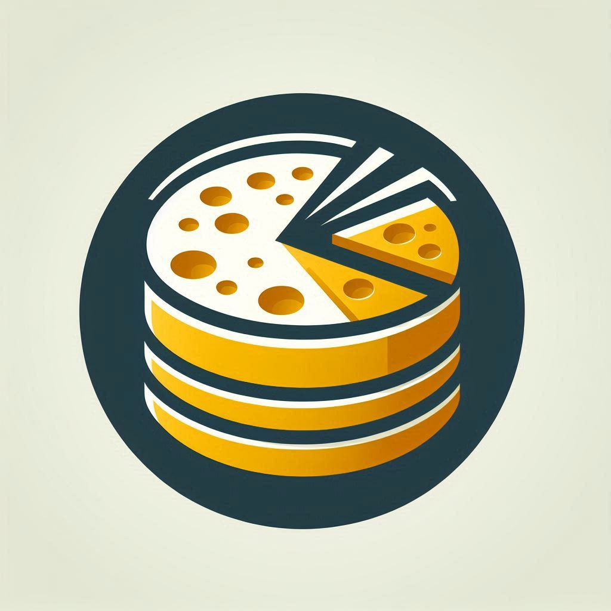
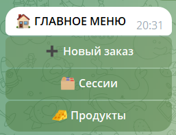
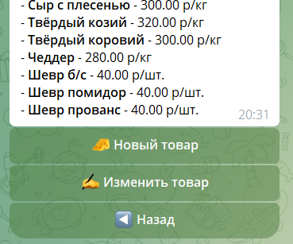
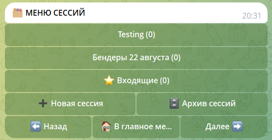
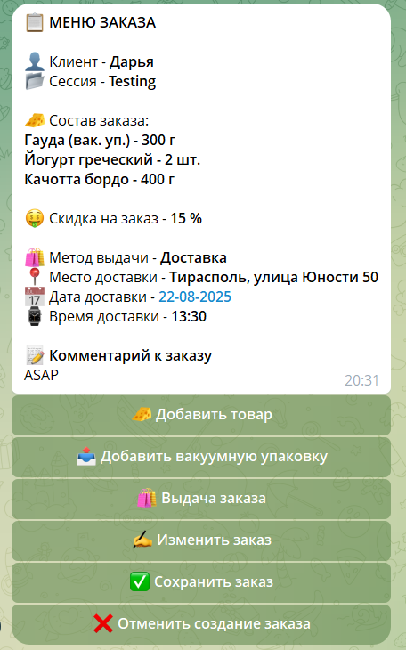
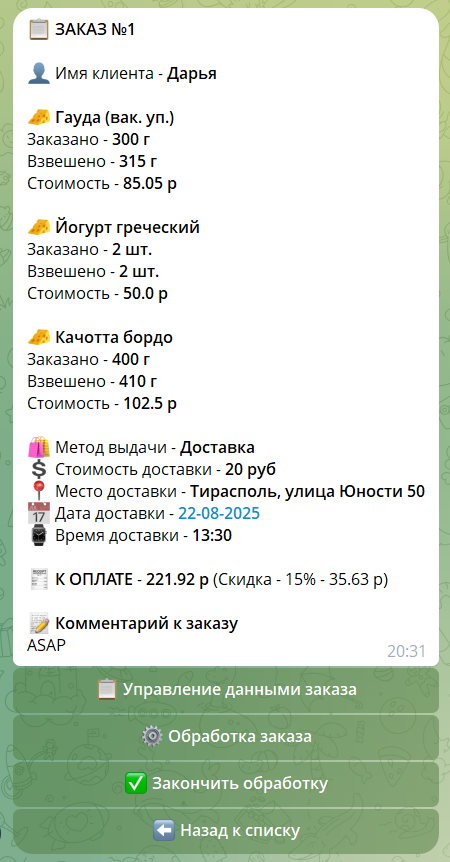
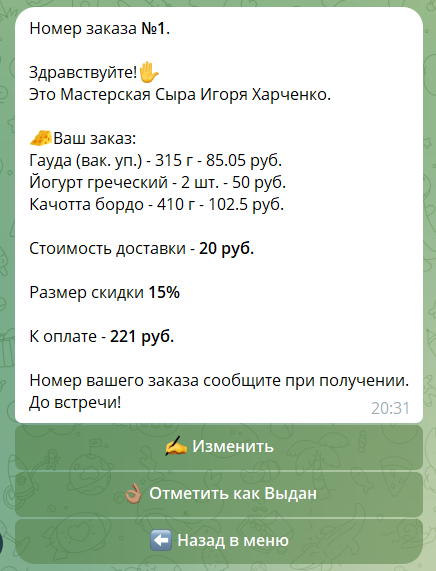
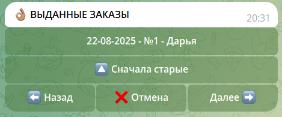
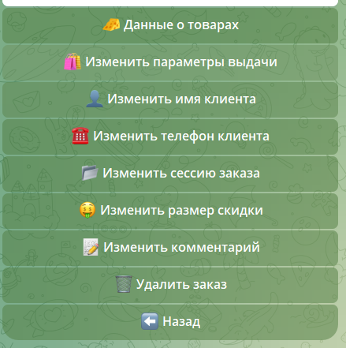
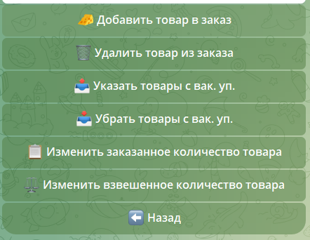

<h1 align="center"> Order Processing Application </h1>

  

## Stack

## Description

A chat bot for processing customer orders in the artisanal cheese production business. The application allows managing products, creating orders, controlling their processing stages, and collecting data for sales analysis. The product database is shared with [the inventory management application for retail outlets](https://github.com/AleIgoKha/outlets_inventory_bot).  

A key feature of the bot is its interface: all interaction happens within a single pinned message, which makes it feel like a full-fledged application rather than a typical chat bot.

## Project Goals

- Improve the user experience at all stages of order processing  
- Reduce the time required to handle orders  
- Minimize errors in price calculation  
- Collect and store sales data for further analysis  

## How It Works 

Main entities: product, session and order.

  

- **Product** — represents an item with a price and unit of measurement.

  

- **Session** — groups orders with common parameters (e.g., date, location, event).

  

- **Order** — includes selected products and options (packaging, delivery, discounts, etc.).

  

Order lifecycle:  

1. **Processing** — record the actual weight of each product and verify the order is correctly assembled.

  

1. **Completed** — the order is fully completed and ready for delivery.

  

1. **Issued** — the order has been handed over to the customer.

  

All order parameters can be updated at any stage.

  
  

